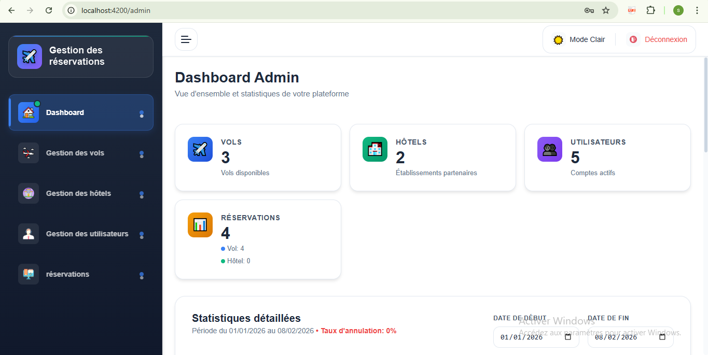
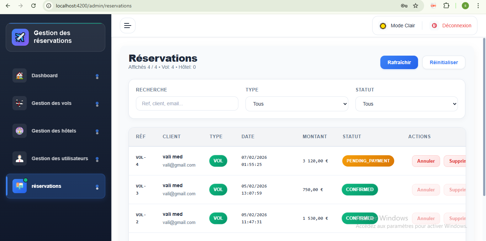
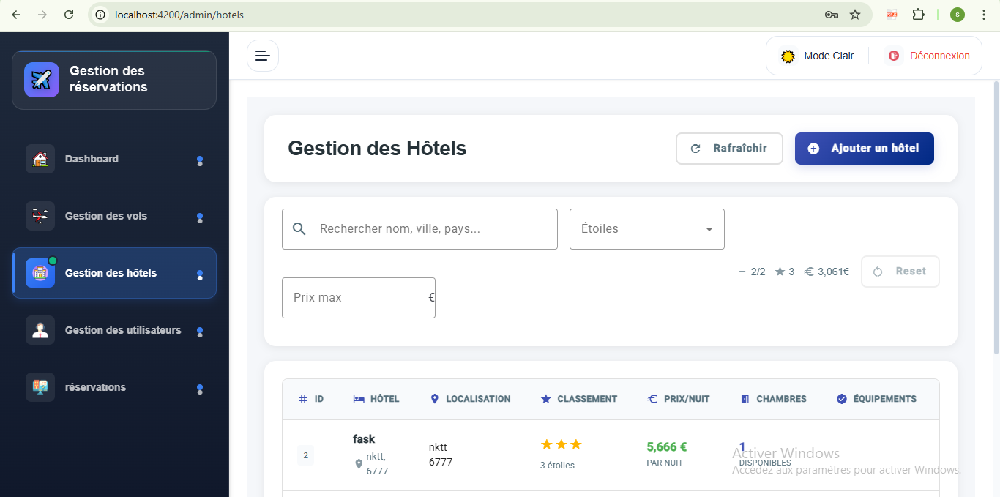
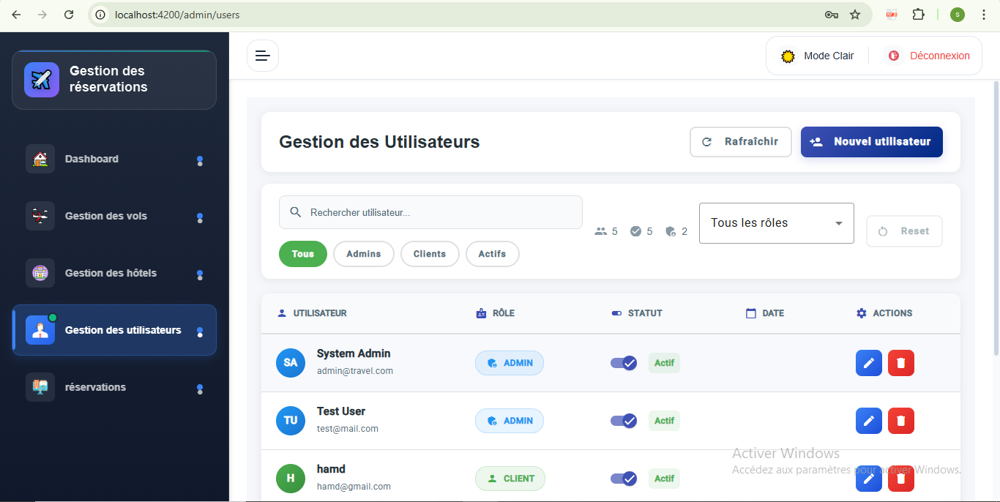
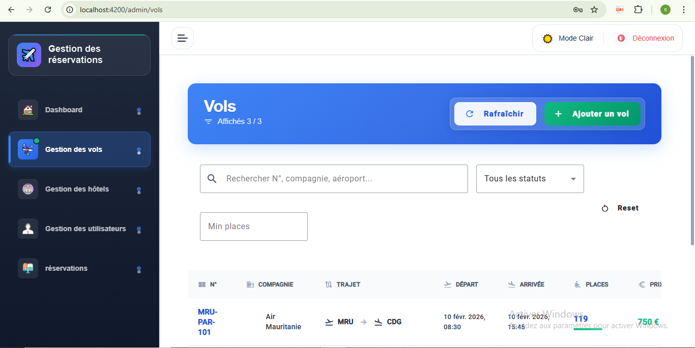
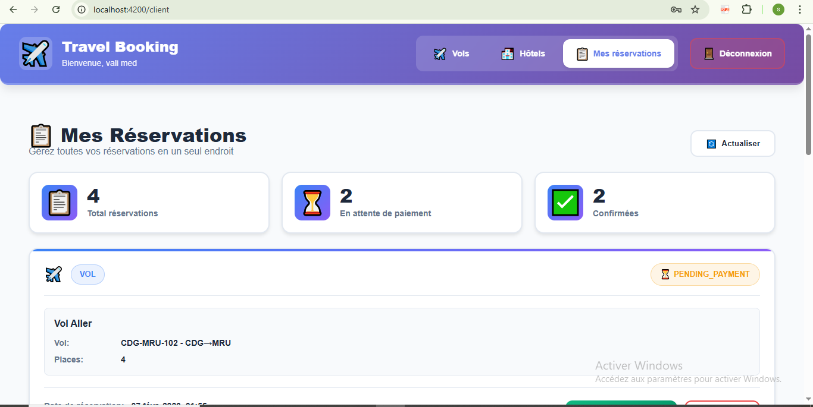
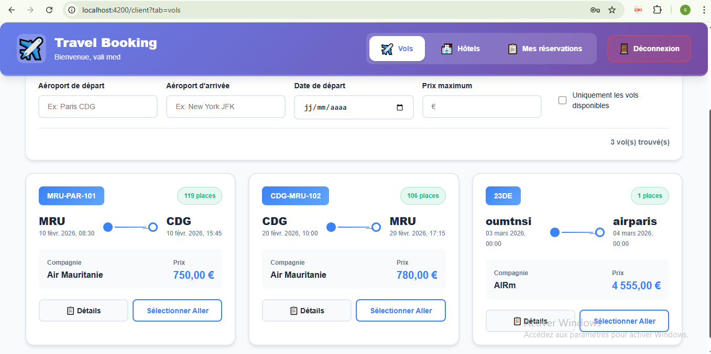
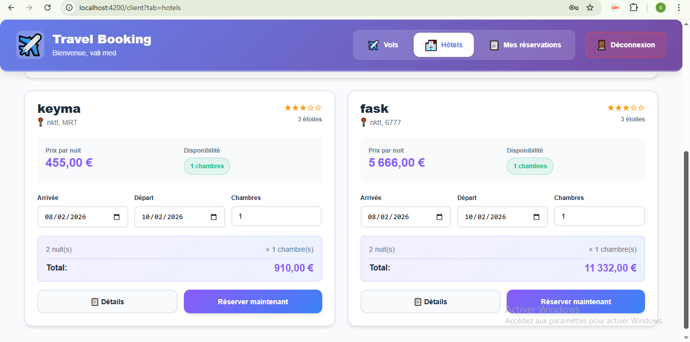
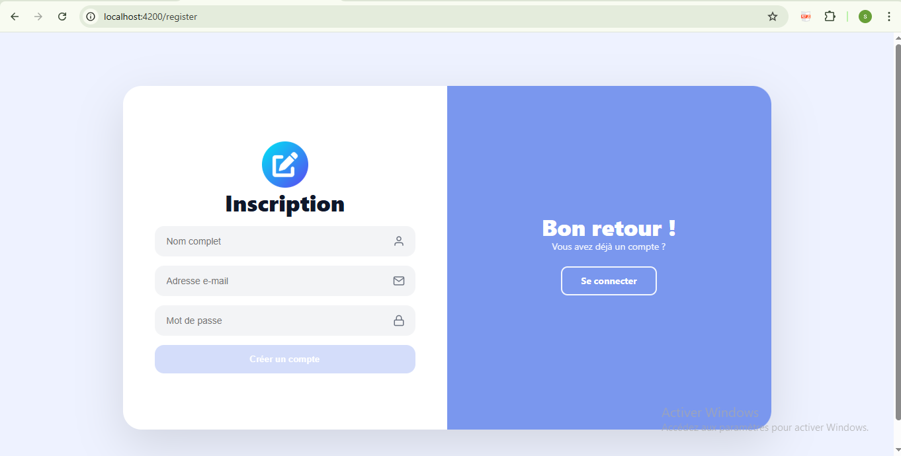
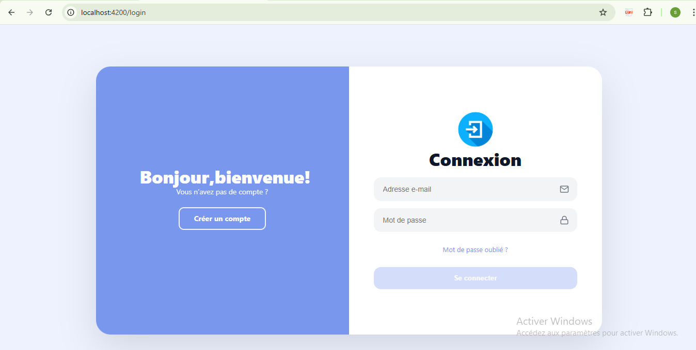

# Travel Reservation System – Fullstack Booking Platform

Modern full-stack travel booking application for **flights** and **hotels**.

**Frontend**: Angular (client + admin panels)  
**Backend**: Spring Boot (secure REST API with JWT authentication)

## 🎯 Main Features

### 👤 Client Features
- Register and login
- Browse and search hotels & flights
- View detailed hotel/flight information and availability
- Make and manage personal reservations
- View reservation history
- Mock payment processing

### 🛠️ Admin Features
- Manage all users (view, block, delete)
- CRUD operations for hotels (add, edit, delete, upload photos)
- CRUD operations for flights (add, edit, delete, set availability)
- View and manage all reservations (confirm, cancel, view details)

### 🔐 Authentication & Security
- User registration + login
- JWT access + refresh token system
- Role-based authorization (CLIENT vs ADMIN)
- Protected endpoints
- Secure password storage
- JWT filter + custom UserDetails

## 🛠️ Technologies

**Backend**
- Java 17+
- Spring Boot 3+
- Spring Security + JWT
- Spring Data JPA / Hibernate
- PostgreSQL / MySQL
- Lombok
- MapStruct (DTO mapping)
- Spring Boot Starter Web, Validation, Security

**Frontend**
- Angular 17+
- TypeScript
- Angular Material / Tailwind CSS / Bootstrap (depending on your choice)
- RxJS
- HttpClient + interceptors (for JWT)
- Reactive Forms
- Lazy-loaded modules / feature-based structure

## 📂 Project Structure

**Backend (Spring Boot)**

```text
com.example.reservations_voyages/
├── auth/
│   ├── AuthController.java
│   ├── AuthService.java
│   ├── dto/
│   │   ├── AuthResponse.java
│   │   ├── LoginRequest.java
│   │   └── RefreshTokenRequest.java
│   └── AuthMapper.java
├── security/
│   ├── config/
│   │   └── SecurityConfig.java
│   ├── jwt/
│   │   ├── JwtService.java
│   │   ├── JwtAuthFilter.java
│   │   └── JwtProperties.java
│   └── CustomUserDetailsService.java
├── user/
│   ├── User.java
│   ├── UserRepository.java
│   ├── UserService.java
│   └── UserController.java
├── hotel/
│   ├── Hotel.java
│   ├── HotelRepository.java
│   ├── HotelService.java
│   └── HotelController.java
├── flight/
│   ├── Flight.java
│   ├── FlightRepository.java
│   ├── FlightService.java
│   └── FlightController.java
└── reservation/
    ├── Reservation.java
    ├── ReservationRepository.java
    ├── ReservationService.java
    └── ReservationController.java


Frontend (Angular) :
src/app/features/
├── auth/
│   ├── login/
│   ├── register/
│   ├── forgot-password/
│   └── reset-password/
├── client/
│   ├── client-home/
│   ├── hotels/
│   ├── flights/
│   ├── reservations/
│   └── payment/
└── admin/
    ├── admin-dashboard/
    ├── users/
    ├── hotels/
    ├── flights/
    └── reservations/

🚀 How to Run Locally
Backend

# 1. Clone the repository
git clone https://github.com/seydnaaly/travel-reservation-system.git

# 2. Go to backend folder (adjust if needed)
cd travel-reservation-system/backend

# 3. Configure application.properties or application.yml
#    - database connection
#    - jwt secret key
#    - server port (default 8080)

# 4. Run
./mvnw clean install
./mvnw spring-boot:run

API available at: http://localhost:8080

Frontend
# 1. Go to frontend folder (adjust if needed)
cd travel-reservation-system/frontend

# 2. Install dependencies
npm install

# 3. Start development server
ng serve --open
# or
npm start

Frontend available at: http://localhost:4200
Make sure backend is running — frontend calls http://localhost:8080/api/...


## 📸 Screenshots

### Admin Dashboard


### Admin Reservations Management


### Admin Hotels Management


### Admin Users Management


### Admin Flights Management


### Client Reservations Page


### Client Flights Search


### Client Hotels List


### Register Page


### Login Page



📌 Status & Next Steps

Project completed and functional
Code is structured and follows good practices
Ready to demonstrate in interviews / freelance proposals
Possible improvements: real payments (Stripe), email notifications, advanced search filters, deployment (Docker, Render/Railway/Vercel/Netlify)

📬 Contact
Looking for freelance opportunities:
Angular • Spring Boot • Java • Fullstack • API development • Travel/Booking systems
Email: seydnaalyeby@gmail.com
Feel free to ⭐ this repo if you find it useful!

